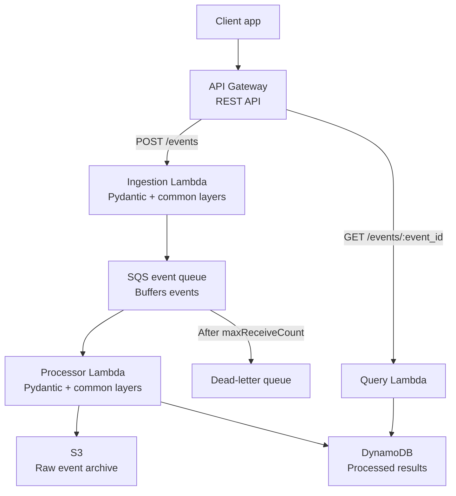
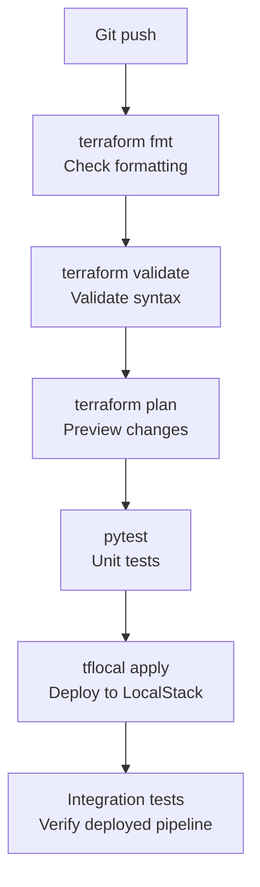

# EventFlow
[](https://github.com/Habib-Amami/EventFlow/actions/workflows/ci.yml)

EventFlow is an event ingestion pipeline built with AWS Lambda, API Gateway, SQS, S3, and DynamoDB.

## Architecture


The processor uses partial batch failure reporting. Successful SQS messages are deleted; failed messages are retried and eventually moved to the dead-letter queue.

## Delivery Workflow

The CI workflow checks the infrastructure and unit tests before deployment. LocalStack deployment and integration tests verify the complete event path.



## Prerequisites

- Python 3.14
- `uv`
- Terraform 1.16+
- AWS credentials for AWS deployment, or LocalStack for local integration tests

## Install and test

```bash
uv sync --dev
uv run pytest -m "not integration" -q
```

Run the full LocalStack integration test by providing the `POST /events` URL:

```bash
export EVENTFLOW_API_URL="http://localhost:4566/dev/events"
uv run pytest -m integration -q
```

The test creates an event, waits for asynchronous processing, and queries it through `GET /events/{event_id}`.

## Terraform

From the `terraform/` directory:

```bash
terraform init
terraform fmt -check -recursive
terraform validate
terraform plan
terraform apply
```

Useful outputs:

```bash
terraform output -raw events_url
terraform output -raw query_url
```

The Pydantic and common Lambda layers are built by the `lambda-layer` module. The layer build uses `uv`, so `uv` must be available wherever Terraform runs.

## API examples

Create an event:

```bash
curl -X POST "$(terraform -chdir=terraform output -raw events_url)" \
	-H "Content-Type: application/json" \
	-d '{"service":"billing","environment":"dev","event_type":"invoice.created","message":"Invoice created"}'
```

Query an event:

```bash
curl "$(terraform -chdir=terraform output -raw query_url | sed 's/{event_id}/EVENT_ID/')"
```

Replace `EVENT_ID` with the ID returned by the create request.

## Project layout

```text
services/       Lambda handlers
layers/         Pydantic and shared-code Lambda layers
terraform/      Infrastructure and module wiring
tests/unit/     Mocked unit tests
tests/integration/  Deployed API integration test
```

The API is currently unauthenticated for development and LocalStack use. Add API authentication before production deployment.
